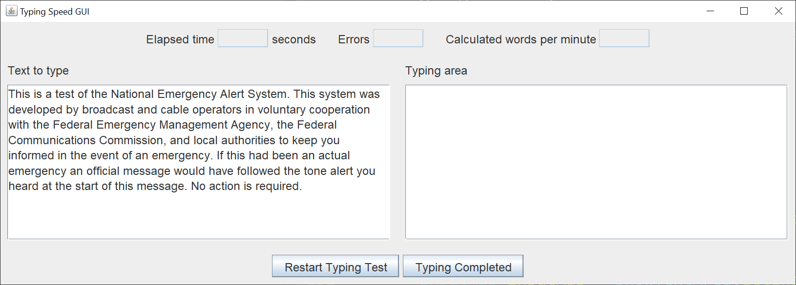

# Typing Speed Test GUI

## Introduction

I created a typing speed test GUI.  Here's what the GUI looks like when you start it.

Thw text on the left comes from a TypingText class.  The text is hard coded for this demonstration.  The class should be expanded to read several blocks of text from a file, pick one of the blocks at random, and display that text on the left.

The typing area on the right is where you type the displayed text on the left.  A timer starts when you type the first character into the typing area.  If the text on the left is longer than 10 lines, scroll bars will appear in the left text area and the right typing area.  The scoll bars in the left text area and right typing area are synchronized, so you don't have to stop typing to scoll the left text area.  When you're finished typing, you left-click the Typing Completed button on the bottom.  The elapsed time in seconds, number of errors and words per minute (WPM) are displayed on the top panel.

The Restart Typing Test button clears the display fields and allows you to restart the typing speed test.

The font size is 16 point.  You can reduce this to make the GUI smaller.  Alas, my vision is no longer 20 / 20.

## Explanation

If you’re not familiar with Java Swing, Oracle has an excellent tutorial to get you started, [Creating a GUI With JFC/Swing](https://docs.oracle.com/javase/tutorial/uiswing/index.html). Skip the Netbeans section.

When I create a Swing GUI, I use the [model / view / controller](https://en.wikipedia.org/wiki/Model%E2%80%93view%E2%80%93controller) (MVC) pattern.  This pattern allows me to separate my concerns and focus on one part of the application at a time.

When I say I use the MVC pattern in a Swing application, this is what I mean.

1.  The view may read information from the model.
2.  The view may not update the model.
3.  The controller will update the model and repaint / revalidate the view.

There's usually not one controller class "to rule them all".  Each listener has it's own class.  Each independent listener acts on a part of the model and view.

This Swing application consists of one model class, one view class, and four controller classes.  The model class is not updated in this example application, since I hard coded one text block.  The RestartListener controller class would be responsible for picking a text block at random and displaying the text block in the left text area.

### Model

The TypingText class is a plain Java getter / setter class.  This class would be responsible for reading a file containing multiple blocks of text and picking one at random.

### View

The view consists of a JFrame and four JPanels.  Each JPanel is constructed in its own method.  The JFrame is constructed in a separate method.  Separating all this view code into methods allowed me to separate my concerns and focus on one part of the GUI at a time.

The cut (Cntl X) and copy (Cntl C) actions are disabled in the JTextArea of the left text display.  This prevents cheating.

The only unusual part of the GUI code is the synchronization of the two JScrollPanes.  I basically copied this code from [Synchronize two JScrollPanes](https://coderanch.com/t/339632/java/synchronize-ScrollPane).

### Controller

The Synchronizer class synchronizes the JScrollBars of the JScrollPanes.

The StartListener class starts the timer when the first character is typed in the right JTextArea.

The TypingEndListener class calculates the statistics on the upper statistics JPanel.  The error calculation probably needs to be more dophisticated.  I didn't want to add a lot of code to detect missing or extra characters.

The RestartListener class resets the GUI for another attempt / another person.
